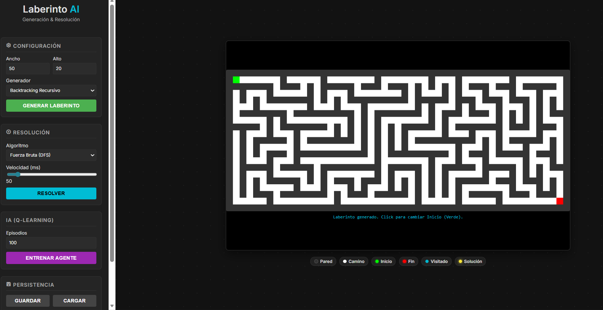

# Laberinto WebApp

## Descripción
Aplicación web con Flask y JavaScript para generar, visualizar y resolver laberintos, con lógica de generación, solución e IA.

## Objetivo
Explorar algoritmos de generación de laberintos, búsqueda de rutas y visualización interactiva.

## Tecnologías utilizadas
- Python
- Flask
- JavaScript
- Three.js
- HTML/CSS
- NumPy

## Funcionalidades principales
- Generación de laberintos
- Resolución con búsqueda
- Agente IA
- Visualización Canvas/Three.js
- Backend Flask

## Mi rol
Implementé lógica de laberintos, backend Flask e interfaz web.

## Aprendizajes clave
- Algoritmos de grafos
- Renderizado interactivo
- Flask templates/static
- Separación lógica/presentación

## Instalación y ejecución
```bash
cd Laberinto-WebApp
python -m venv .venv
.venv\Scripts\activate
pip install -r requirements.txt
python app.py
```

## Estructura del proyecto
- app.py: servidor
- logic/: algoritmos
- templates/: vista
- static/: JS/CSS
- DOCUMENTACION.md: soporte

## Capturas o demo


## Estado del proyecto
Proyecto académico funcional.

## Valor técnico demostrado
Demuestra algoritmos, visualización web y separación de capas.

## Mejoras futuras
- Agregar pruebas
- Documentar parámetros
- Publicar demo

## Autor
Geovanni González  
Estudiante de Ingeniería en Computación  
GitHub: [Geovanni-Gonzalez](https://github.com/Geovanni-Gonzalez)


